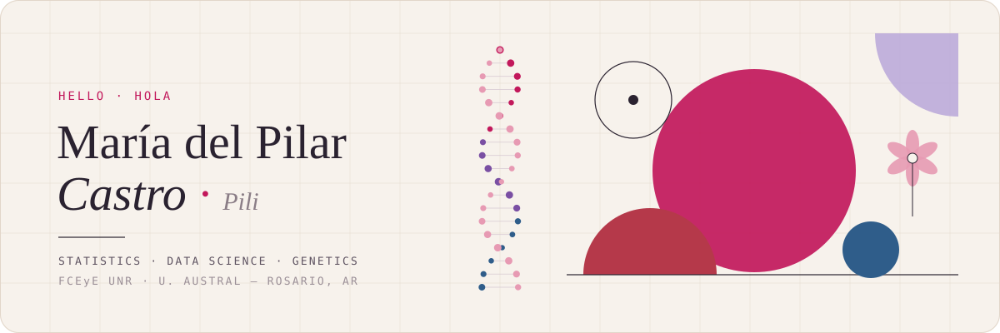
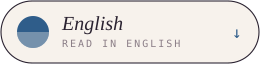
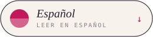
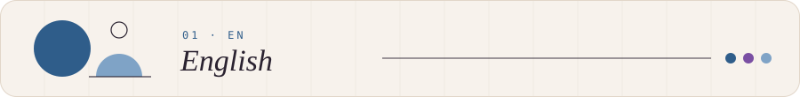
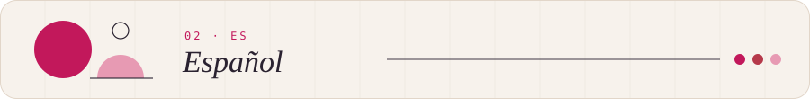
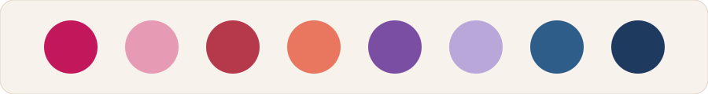

## hi ✿

<!-- ✿ perfil de Pili ✿ -->

  

  
  &nbsp;&nbsp;
  

 

<!-- ─────────────────────────────── ENGLISH ─────────────────────────────── -->

  

### ◐ &nbsp;about me

I study **Statistics** at the FCEyE *(Facultad de Ciencias Económicas y Estadística, UNR)* and **Data Science** at the Faculty of Engineering *(Universidad Austral)*, in Rosario, Argentina.

I'm drawn to the place where **data meets genetics**: how statistics can help us read what DNA is telling us, from Mendelian inheritance to gene editing.

I like things that are well built: clean code, clear charts and design with intention. Bauhaus, architecture, abstract art and flowers inspire me as much as a good dataset.

### ◑ &nbsp;currently

- ◦ &nbsp;Analyzing data in **R** with the tidyverse and writing reproducible reports in **Quarto**
- ◦ &nbsp;Going deeper into **Python** and object-oriented programming
- ◦ &nbsp;Studying **probability models and inference** (Statistics II)
- ◦ &nbsp;Competed for the first time in **TAP 2026** and going to the Regionals! (Argentine Programming Tournament · ICPC)

### ◓ &nbsp;projects

| project | what it is | stack |
|---|---|---|
| [**BloodLust**](https://github.com/pilxxx/BloodlustArt.git) | A game made with friends | 3dsMax · Unity · C#|
| [**SUBE**](https://github.com/pilxxx/MauriTarjetaDiciembre) | The Farkle dice game, built as a team | R |
| [**portal-de-noticias**](https://github.com/pilxxx/proyectoTallerdeInternet) | A news site with a live dollar-rate API and login | HTML · CSS · JS |
| [**negativos**](to be uploaded) | An R package documented with `roxygen2` and `devtools` | R |
| [**uso-de-ia**](to be uploaded) | Exploratory analysis of how students use AI | R · tidyverse · ggplot2 |

 

<!-- ─────────────────────────────── ESPAÑOL ─────────────────────────────── -->

  

### ◐ &nbsp;sobre mí

Estudio **Estadística** en la FCEyE *(Facultad de Ciencias Económicas y Estadística, UNR)* y **Ciencia de Datos** en la Facultad de Ingeniería *(Universidad Austral)*, en Rosario, Argentina.

Me interesa el cruce entre **los datos y la genética**: cómo la estadística puede ayudar a leer lo que dice el ADN, desde la herencia mendeliana hasta la edición génica.

Me gustan las cosas bien construidas: el código prolijo, los gráficos claros y el diseño con intención. La Bauhaus, la arquitectura, el arte abstracto y las flores me inspiran tanto como un buen dataset.

### ◑ &nbsp;ahora mismo

- ◦ &nbsp;Analizando datos en **R** con el tidyverse y armando informes reproducibles en **Quarto**
- ◦ &nbsp;Profundizando en **Python** y programación orientada a objetos
- ◦ &nbsp;Estudiando **modelos de probabilidad e inferencia** (Estadística II)
- ◦ &nbsp;Participé por primera vez en el **TAP 2026** (Torneo Argentino de Programación · ICPC)

### ◓ &nbsp;proyectos

| proyecto | qué es | stack |
|---|---|---|
| [**BloodLust**](https://github.com/pilxxx/BloodlustArt.git) | Juego realizado con amigos | 3dsMax · Unity · C#|
| [**SUBE**](https://github.com/pilxxx/MauriTarjetaDiciembre) | Una copia de la tarjeta SUBE | C# |
| [**portal-de-noticias**](https://github.com/pilxxx/proyectoTallerdeInternet) | Portal web con API de cotización del dólar y login | HTML · CSS · JS |
| [**negativos**](en proceso) | Paquete de R documentado con `roxygen2` y `devtools` | R |
| [**uso-de-ia**](en proceso) | Análisis exploratorio sobre el uso de IA entre estudiantes | R · tidyverse · ggplot2 |

 

<!-- ─────────────────────────── COMPARTIDO / SHARED ─────────────────────────── -->

  

### ◒ &nbsp;tools · herramientas

  
  
  
  
  
  
  
  

### ✿ &nbsp;color garden · jardín de color

A tiny game: circles that change color when you tap them. &nbsp;*Un pequeño juego: redondeles que mutan de color cuando los tocás.*
**[Play / Jugar →](https://pilxxx.github.io)**

  

 

  
  

Rosario, Argentina &nbsp;·&nbsp; <code>data</code> · <code>form</code> · <code>color</code>

